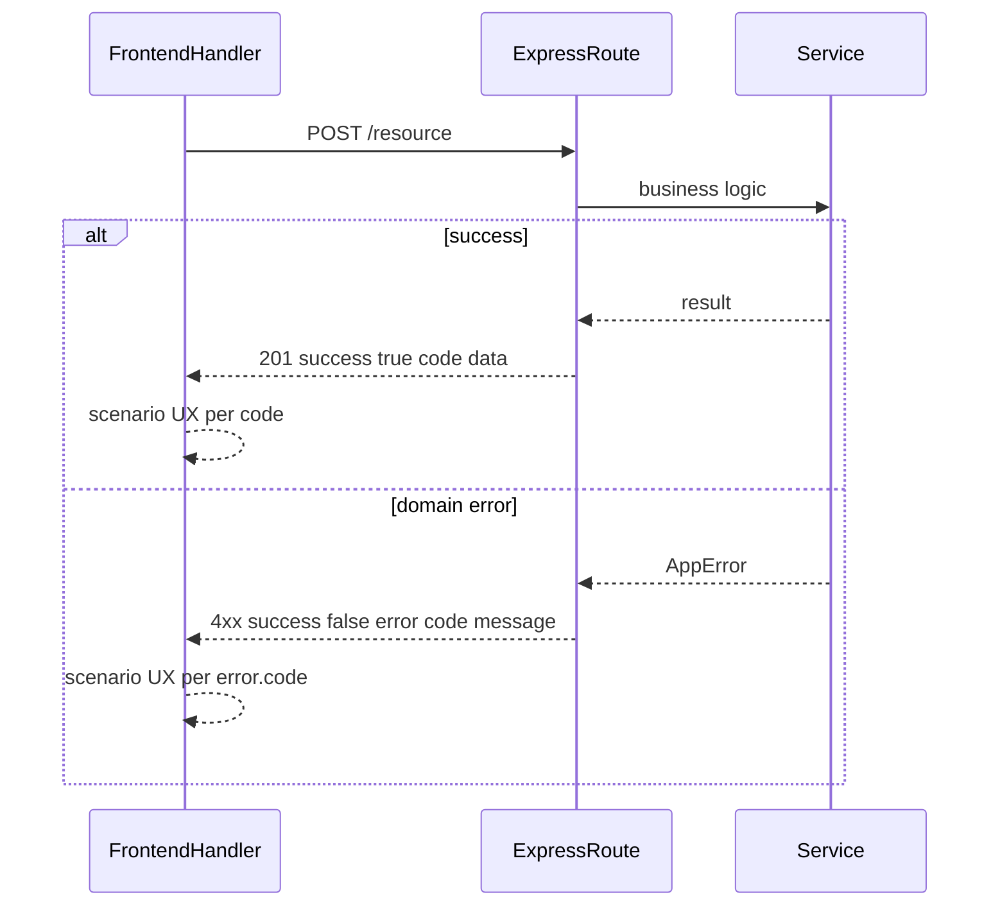

# Code Style

How AI agents must write and document code. **Read-only template** — project stack is in [`PROJECT/AGENTS.MD`](PROJECT/AGENTS.MD).

Every non-trivial function, route handler, service method, client-side API handler, and React component with business logic gets a structured block comment **above** the declaration, plus inline step comments **inside** the body that match the Logic section.

Every API request must return a proper HTTP status, JSON envelope with a **response `code`**, and on the frontend handlers must cover **all scenarios** with the correct UX (Alert, redirect, modal, etc.) — see section 8.

UI styling: [`PROJECT/DESIGN.MD`](PROJECT/DESIGN.MD). Structure and workflow: [`AGENTS.MD`](AGENTS.MD).

## 1. Block Comment Template

Place a block comment immediately above the function, method, or handler:

```
/**
 * Function:  <one-line summary of what this entry point does>
 *             <HTTP method and path, if applicable>
 * Variables:
 *   <name> - <source>; <description>
 * Logic:
 *   1. <first step>
 *   2. <second step>
 * Additional:
 *   - <integration notes, auth rules, content types, side effects, etc.>
 */
```

### Field rules

| Field | Required | Purpose |
|-------|----------|---------|
| **Function** | Yes | What the code does. Include route/method for API handlers. |
| **Variables** | Yes when params exist | Every parameter, prop, or request field and where it comes from. |
| **Logic** | Yes | Numbered steps the body implements, in order. |
| **Additional** | When relevant | Auth, audience, response format, packages used, edge cases. |

Logic steps must match inline comments inside the body (see section 2).

## 2. Inline Step Comments

```typescript
// Logic-1: <same wording as Logic step 1>
// Logic-2: <same wording as Logic step 2>
```

Rules:
- One inline comment per Logic step, in order
- Wording aligns with the block comment
- Trivial one-liners may omit the block comment

## 3. API Route Example (Express / TypeScript)

```typescript
/**
 * Function:  REST entry point for withdrawing a team invitation.
 *             DELETE /api/invitations/:invitationId/withdraw
 * Variables:
 *   invitationId - path parameter; ID of the invitation to withdraw
 *   body         - JSON body (WithdrawInvitationDto); optional reason
 *   req.user     - authenticated caller from auth middleware
 * Logic:
 *   1. Verify caller belongs to the team that owns the invitation
 *   2. Delegate to invitationService.withdraw with caller ID, invitationId, body
 * Additional:
 *   - Requires authenticated employee session
 *   - Returns JSON { success, code, data } or standard error envelope with error.code
 */
router.delete(
  '/:invitationId/withdraw',
  async (req: AuthRequest, res: Response, next: NextFunction) => {
    try {
      const { invitationId } = req.params;
      const body = req.body as WithdrawInvitationDto;

      // Logic-1: verify caller belongs to the team that owns the invitation
      const invitation = await invitationService.findById(invitationId);
      if (!invitation || !await teamService.isMember(req.user.id, invitation.teamId)) {
        throw new ForbiddenError('You do not have access to this invitation');
      }

      // Logic-2: delegate to withdraw service
      const result = await invitationService.withdraw(req.user.id, invitationId, body);
      return res.json({ success: true, code: 'INVITATION_WITHDRAWN', data: result });
    } catch (error) {
      next(error);
    }
  }
);
```

## 4. Service / Business Logic Example

```typescript
/**
 * Function:  Withdraw a pending invitation and notify the invitee.
 * Variables:
 *   callerId     - ID of the employee performing the withdraw
 *   invitationId - ID of the invitation record
 *   dto          - optional reason and metadata
 * Logic:
 *   1. Load invitation; reject if not found or not pending
 *   2. Update status to withdrawn and persist
 *   3. Send notification to the invitee
 * Additional:
 *   - Runs inside a DB transaction
 *   - Idempotent if invitation is already withdrawn
 */
async function withdraw(
  callerId: string,
  invitationId: string,
  dto: WithdrawInvitationDto
): Promise<Invitation> {
  return db.transaction(async (tx) => {
    // Logic-1: load invitation; reject if not found or not pending
    const invitation = await tx.invitation.findUnique({ where: { id: invitationId } });
    if (!invitation) throw new NotFoundError('Invitation not found');
    if (invitation.status !== 'pending') throw new ConflictError('Invitation is not pending');

    // Logic-2: update status to withdrawn and persist
    const updated = await tx.invitation.update({
      where: { id: invitationId },
      data: { status: 'withdrawn', reason: dto.reason, withdrawnBy: callerId },
    });

    // Logic-3: send notification to the invitee
    await notificationService.sendWithdrawNotice(updated);

    return updated;
  });
}
```

## 5. Next.js Server Action Example

```typescript
/**
 * Function:  Server action to create a new project for the active team.
 * Variables:
 *   formData - FormData from client; name, description, teamId
 * Logic:
 *   1. Parse and validate form fields
 *   2. Verify session user is a member of the team
 *   3. Create project via projectService and revalidate cache
 * Additional:
 *   - Called from web UI only; not for external integrations
 *   - Revalidates /dashboard/projects after success
 */
export async function createProject(formData: FormData) {
  // Logic-1: parse and validate form fields
  const parsed = createProjectSchema.safeParse({
    name: formData.get('name'),
    description: formData.get('description'),
    teamId: formData.get('teamId'),
  });
  if (!parsed.success) throw new ValidationError(parsed.error);

  // Logic-2: verify session user is a member of the team
  const session = await getSession();
  if (!session || !await teamService.isMember(session.userId, parsed.data.teamId)) {
    throw new ForbiddenError('Not a team member');
  }

  // Logic-3: create project and revalidate cache
  const project = await projectService.create(session.userId, parsed.data);
  revalidatePath('/dashboard/projects');
  return project;
}
```

## 6. React Presentational Component Example

Pure display components with no API calls or business logic. Block comments are still required when logic spans multiple steps.

```typescript
/**
 * Function:  Dashboard card showing team KPI with premium gold highlight when target is met.
 * Variables:
 *   title   - prop; metric label
 *   value   - prop; current numeric value
 *   target  - prop; goal threshold for gold accent
 * Logic:
 *   1. Determine whether value meets or exceeds target
 *   2. Render metric card with blue default or gold highlight styling
 * Additional:
 *   - Follow PROJECT/DESIGN.MD KPI card spec (gold left accent when target met)
 */
export function KpiCard({ title, value, target }: KpiCardProps) {
  // Logic-1: determine whether value meets or exceeds target
  const targetMet = value >= target;

  // Logic-2: render metric card with appropriate accent styling
  return (
    <div className={cn('kpi-card', targetMet && 'kpi-card--gold')}>
      <span className="kpi-card__title">{title}</span>
      <span className="kpi-card__value">{value}</span>
    </div>
  );
}
```

## 7. Frontend Client Handler / Page Example

Client pages and handlers that call the API need the same block-comment discipline as backend code. Document every response scenario and UX action in block comments; use `@/components/Alert` for inline feedback (see section 8).

### When frontend block comments are required

- Client event handlers that call the API (`handleSubmit`, `handleRun`, `load`, etc.)
- Custom hooks with business logic
- **Not required** for pure presentational components (see section 6)

```typescript
"use client";

import { FormEvent, useEffect, useState } from "react";
import { useRouter } from "next/navigation";
import { apiFetch, apiPost } from "@/lib/api";
import { Alert } from "@/components/Alert";
import { Button } from "@/components/Button";
import { Input } from "@/components/Input";

/**
 * Function:  Client page to create a company and chief assistant.
 * Variables:
 *   router - Next.js router; redirect after successful creation
 * Logic:
 *   1. On mount, verify session via GET /auth/me; UNAUTHORIZED → redirect /login; other errors → Alert
 *   2. On submit, POST /companies; VALIDATION_FAILED/other → Alert; success → continue
 *   3. POST chief assistant; on failure show error Alert; on success redirect to company detail
 * Additional:
 *   - Uses apiPost from @/lib/api
 *   - Scenarios: UNAUTHORIZED → redirect; validation/server errors → Alert; create success → redirect (no success Alert)
 */
export default function NewCompanyPage() {
  const router = useRouter();
  const [companyName, setCompanyName] = useState("");
  const [assistantName, setAssistantName] = useState("");
  const [error, setError] = useState("");
  const [loading, setLoading] = useState(false);

  /**
   * Function:  Load session and redirect unauthenticated users.
   * Logic:
   *   1. Fetch GET /auth/me
   *   2. UNAUTHORIZED or no user → redirect /login; other error codes → error Alert
   */
  async function load() {
    const res = await apiFetch<{ user: { id: string } | null }>("/auth/me");
    if (!res.success) {
      if (res.error?.code === "UNAUTHORIZED") {
        router.push("/login");
        return;
      }
      setError(res.error?.message ?? "Failed to verify session");
      return;
    }
    if (!res.data?.user) router.push("/login");
  }

  useEffect(() => {
    load();
  }, [router]);

  /**
   * Function:  Create company and chief assistant via API.
   * Variables:
   *   e - form submit event
   * Logic:
   *   1. Clear prior alerts and POST /companies with company name
   *   2. On failure, branch by error.code — VALIDATION_FAILED or other → error Alert
   *   3. POST chief assistant; on failure show error Alert; on success redirect
   */
  async function handleSubmit(e: FormEvent) {
    e.preventDefault();
    setLoading(true);
    setError("");

    // Logic-1: clear prior alerts and POST /companies with company name
    const companyRes = await apiPost<{ company: { id: string } }>("/companies", {
      name: companyName,
    });
    if (!companyRes.success || !companyRes.data?.company) {
      setError(companyRes.error?.message ?? "Failed to create company");
      setLoading(false);
      return;
    }

    // Logic-2: on failure, branch by error.code — show error Alert (handled above)
    // Logic-3: POST chief assistant; on failure show error Alert; on success redirect
    const assistantRes = await apiPost<{ agent: unknown }>(
      `/companies/${companyRes.data.company.id}/assistant`,
      { assistantName }
    );
    setLoading(false);

    if (!assistantRes.success) {
      setError(assistantRes.error?.message ?? "Failed to create assistant");
      return;
    }

    router.push(`/companies/${companyRes.data.company.id}`);
  }

  return (
    <form onSubmit={handleSubmit} className="space-y-4">
      <Input label="Company Name" value={companyName} onChange={(e) => setCompanyName(e.target.value)} required />
      <Input label="Chief Assistant Name" value={assistantName} onChange={(e) => setAssistantName(e.target.value)} required />
      <Alert variant="error">{error}</Alert>
      <Button type="submit" disabled={loading}>
        {loading ? "Creating..." : "Create Company"}
      </Button>
    </form>
  );
}
```

## 8. Request Feedback Rule

Applies to **every** user-initiated or page-critical API request (fetch, create, update, delete, run). Backend responses must include HTTP status, JSON envelope, and a **response `code`**. Frontend handlers must handle **every scenario** with the correct UX action.

### Backend (required)

All routes return a JSON envelope matching the frontend `ApiResponse<T>` type:

```typescript
// Success
{ success: true, code: string, data: T }                    // HTTP 200 or 201

// Failure
{ success: false, error: { code: string, message: string } }  // HTTP 4xx or 5xx
```

| Case | HTTP status | Body |
|------|-------------|------|
| Success (read) | `200` | `{ success: true, code, data }` |
| Success (create) | `201` | `{ success: true, code, data }` |
| Validation / domain error | `400`–`409` via `AppError` | `{ success: false, error: { code, message } }` |
| Auth failure | `401` | `{ success: false, error: { code, message } }` |
| Not found | `404` | `{ success: false, error: { code, message } }` |
| Unexpected | `500` | `{ success: false, error: { code, message } }` |

Rules:
- `code` is **required** on every response — stable machine-readable identifier in **SCREAMING_SNAKE_CASE** (e.g. `TODO_CREATED`, `VALIDATION_FAILED`, `UNAUTHORIZED`, `NOT_FOUND`)
- Namespace by domain when helpful (`AUTH_UNAUTHORIZED`, `TODO_NOT_FOUND`)
- Success codes describe the operation outcome (`COMPANY_CREATED`, `SETTINGS_UPDATED`, `TODO_LIST_FETCHED`)
- `AppError` (or stack equivalent) carries `code` + `message`; `errorHandler` always emits both in the envelope
- Route handlers call `next(error)` for failures — never swallow errors or return `200` with `success: false` unless the HTTP status also reflects failure
- Use `res.status(201).json({ success: true, code: 'COMPANY_CREATED', data })` for creates
- Document response codes in route block comment `Additional` and in `PROJECT/DOCUMENT/{feature}/api-specification-document.md` when the feature has an API spec

```typescript
/**
 * Function:  Create a new company for the authenticated user.
 *             POST /companies
 * Variables:
 *   req.body - JSON body; company name
 *   req.user - authenticated user from auth middleware
 * Logic:
 *   1. Validate request body with zod schema
 *   2. Create company via companyService
 *   3. Return 201 with success envelope and code COMPANY_CREATED
 * Additional:
 *   - Success code: COMPANY_CREATED
 *   - Error codes: VALIDATION_FAILED, UNAUTHORIZED (via errorHandler)
 *   - Errors delegated to errorHandler via next(error)
 */
router.post('/', async (req: AuthRequest, res: Response, next: NextFunction) => {
  try {
    const parsed = companySchema.safeParse(req.body);
    if (!parsed.success) throw new ValidationError('Company name is required');

    // Logic-2: create company via companyService
    const company = await createCompany(req.user!.id, parsed.data.name);

    // Logic-3: return 201 with success envelope and code
    res.status(201).json({ success: true, code: 'COMPANY_CREATED', data: { company } });
  } catch (error) {
    next(error);
  }
});
```

### Frontend (required)

For every `apiFetch`, `apiPost`, `apiPut`, or SSE run:

1. **Always** check `res.success` (or `catch` thrown errors for SSE)
2. **Branch on `res.code` or `res.error?.code`** when UX differs by scenario
3. **On failure** — apply the scenario action below; default to `<Alert variant="error">` with `res.error?.message`
4. **On mutation success** — apply success scenario (Alert, redirect, modal close, list refresh)
5. **On load failure** — never leave the page stuck on "Loading..." silently
6. **Clear** previous alert state at the start of each request

Use `@/components/Alert` for inline feedback — not `window.alert` and not ad-hoc `<p className="text-[var(--text-error)]">` in new code.

### Frontend scenario handling (required)

Every client handler (`load`, `handleSubmit`, `handleDelete`, etc.) must define what happens for **each** outcome **before** coding. List scenarios in the block comment **Logic** or **Additional** section, then implement every branch.

| Scenario | Typical `code` / condition | UX action |
|----------|--------------------------|-----------|
| Success, user stays on page | `success: true` | Success `Alert` or silent refresh |
| Success, navigation expected | `success: true` | `router.push` / redirect — success Alert optional |
| Validation error | `VALIDATION_FAILED`, 400 | Error `Alert`; inline field errors if form |
| Unauthorized | `UNAUTHORIZED`, 401 | Redirect to `/login` |
| Forbidden | `FORBIDDEN`, 403 | Error `Alert`; stay on page |
| Not found (detail load) | `NOT_FOUND`, 404 | Redirect to index or dedicated not-found page |
| Conflict | `CONFLICT`, 409 | Error `Alert`; keep form data |
| Server / network error | 500 or fetch throws | Error `Alert`; end loading state |
| Delete success | `success: true` | Close confirmation modal; refresh list; optional success Alert |

Rules:
- Never leave loading spinners running after any terminal outcome
- Never silently ignore a failed response
- Use `ConfirmModal` for destructive confirm — not `window.confirm`
- Redirect only when the scenario table (or block comment) says so — document why

```typescript
const router = useRouter(); // next/navigation
const [error, setError] = useState("");
const [message, setMessage] = useState("");

/**
 * Function:  Save LLM settings from the settings form.
 * Logic:
 *   1. Clear alerts and PUT /settings/llm
 *   2. UNAUTHORIZED → redirect /login; VALIDATION_FAILED/other → error Alert
 *   3. Success → success Alert (user stays on page)
 */
async function handleSave(e: FormEvent) {
  e.preventDefault();
  setError("");
  setMessage("");

  const res = await apiPut<{ settings: unknown }>("/settings/llm", payload);
  if (!res.success) {
    if (res.error?.code === "UNAUTHORIZED") {
      router.push("/login");
      return;
    }
    setError(res.error?.message ?? "Failed to save settings");
    return;
  }
  setMessage("Settings saved.");
}

// In JSX:
<Alert variant="error">{error}</Alert>
<Alert variant="success">{message}</Alert>
```



## 9. Framework Scaffold Rule

**Never bootstrap a new app from scratch.** When creating a new app under `platforms/`, use the framework's **official starter/scaffold command** — do not hand-roll folder structure, config, or boilerplate.

### Workflow

1. **Identify the framework** from [`PROJECT/AGENTS.MD`](PROJECT/AGENTS.MD)
2. **Look up the official scaffold command** for that framework and version
3. **Run it** targeting the correct `platforms/<app>/` path (document non-obvious commands in PROJECT)
4. **Customize** generated output only where the project requires it
5. **Document** the scaffold choice in `PROJECT/HISTORY/` when bootstrapping a new app

### Example scaffolds (illustrative — search fresh each time)

| Framework | Official scaffold | Example |
|-----------|-------------------|---------|
| Rails | `rails new` | `rails new platforms/api --api` |
| Next.js | `create-next-app` | `npx create-next-app@latest platforms/web` |
| NestJS | `nest new` | `nest new platforms/api` |
| Express (Node) | `express-generator` or framework docs | per PROJECT |
| Laravel | `laravel new` | `laravel new platforms/api` |

### When manual bootstrap is allowed

- No official scaffold exists for the chosen stack
- Scaffold exists but cannot meet a documented PROJECT constraint — note why in history
- Extending an already-scaffolded app (not creating a new one)

### Auth scaffold (frontend and backend)

**Never hand-roll authentication** when the stack has a popular official or de-facto auth scaffold/starter.

Applies to **both** `platforms/web` (frontend) and `platforms/api` (backend). Auth is cross-cutting, but each app installs and integrates its own auth layer.

#### Workflow

1. **Read the stack** from [`PROJECT/AGENTS.MD`](PROJECT/AGENTS.MD)
2. **Search** for the framework's recommended auth scaffold or starter — official docs first
3. **Run scaffold/install** in the correct `platforms/<app>/` before writing custom auth code
4. **Customize** only where PROJECT requires it
5. **Document** the auth scaffold choice in block comment `Additional` and `PROJECT/HISTORY/`

#### Example auth scaffolds (illustrative — search fresh each time)

| Stack | Direction |
|-------|-----------|
| Next.js (App Router) | Auth.js / NextAuth.js scaffold |
| NestJS | `@nestjs/passport` + official auth module patterns |
| Express | Passport.js or framework-adjacent starter |
| Rails API | Devise / devise-jwt |
| Laravel | Breeze, Fortify, or Sanctum per use case |

#### When manual auth is allowed

- No suitable scaffold after documented search — note why in history
- Highly custom auth requirements no starter covers

Auth libraries still follow the **Package-First** rule: run `npm install` (or stack equivalent) in the correct `platforms/<app>/` **before** writing imports.

## 10. Package-First Rule

**Never hand-roll a solved problem.** Before writing custom code for a common capability, search npm and prefer the most popular, well-maintained package that fits the project stack (see [`PROJECT/AGENTS.MD`](PROJECT/AGENTS.MD)).

**Install before import.** Run `npm install <package>` in the correct `platforms/<app>/` directory and confirm success **before** writing any `import` from that package.

### Workflow

1. **Identify the capability** — pagination, icons, dates, validation, auth, file upload, etc.
2. **Search npm** — web search, [npmjs.com](https://www.npmjs.com), or `npm search`
3. **Evaluate candidates** using criteria below
4. **Install via npm** in the correct platforms app — run in terminal first:

```bash
cd platforms/<app> && npm install <package>
```

5. **Then write** thin integration code with imports — only after install succeeds
6. **Document** package choice in block comment `Additional`

### Evaluation criteria

| Criterion | Guidance |
|-----------|----------|
| Popularity | High weekly download counts |
| Maintenance | Recent releases, active repo |
| Stack fit | Compatible with this project's stack |
| Bundle size | Reasonable for the feature (especially frontend) |
| License | MIT/Apache or compatible |

### Example capabilities (search fresh each time)

| Feature | Search for | Typical direction |
|---------|------------|-------------------|
| Icons | `react icons npm` | `lucide-react`, `react-icons` |
| Pagination / tables | `react table pagination npm` | `@tanstack/react-table` |
| UI components | `react component library shadcn mui` | shadcn/ui, Radix, MUI — see [`DESIGN.MD`](DESIGN.MD) component library first |
| Forms + validation | `zod react hook form npm` | `react-hook-form` + `zod` |
| Dates | `date-fns npm` | `date-fns` or `dayjs` |
| API validation | `zod express npm` | `zod` |
| ORM / DB | `prisma postgresql npm` | `prisma` or project choice |

### When manual code is allowed

- No suitable package after documented search — note why in `Additional` or history entry
- Project-specific business logic no generic library covers
- Thin wrappers around an installed package
- Trivial one-liners — not full features

### Document package choice

```
 * Additional:
 *   - Uses @tanstack/react-table for pagination (chosen over manual implementation)
```

Use the platforms app path from [`PROJECT/AGENTS.MD`](PROJECT/AGENTS.MD) (e.g. `platforms/web`, `platforms/api` for this project).

## 11. Entity, Soft Delete & CRUD Conventions

### UUID primary keys

- Every **persisted entity/table** uses a **UUID** primary key (`uuid` in PostgreSQL; UUID type in ORM schema)
- API routes use UUID in path params (e.g. `GET /api/todos/:id`)
- Do not use auto-increment integer IDs for domain entities unless the user explicitly opts out and it is documented in `PROJECT/AGENTS.MD` + `PROJECT/HISTORY/`

### Soft delete

- Every persisted entity includes **`deleted_at`** (nullable timestamp)
- **Delete** sets `deleted_at` to the current time — does not remove the row
- List, search, and detail queries **exclude** rows where `deleted_at` is set (unless an admin/trash feature is explicitly scoped)
- Hard delete only when the user explicitly requests it and it is documented

### Full CRUD (when the feature needs it)

**Trigger:** any feature that manages a named resource collection (todos, users, products, etc.) — if it feels like CRUD, build **all** of it. Do not ship create-only or list-only stubs.

**Backend API (per resource):**

| Operation | Endpoint pattern | Notes |
|-----------|------------------|-------|
| Index | `GET /api/{resource}` | Query params: `search`, `filter`, `sort`, `page`, `pageSize` |
| Detail | `GET /api/{resource}/:id` | UUID param; 404 if missing or soft-deleted |
| Create | `POST /api/{resource}` | Returns 201 + envelope with success `code` |
| Update | `PUT` or `PATCH /api/{resource}/:id` | Returns envelope with success `code` |
| Delete | `DELETE /api/{resource}/:id` | Soft delete; returns success envelope with `code` |

Use package-first for pagination/tables (section 10 — e.g. `@tanstack/react-table`).

**Frontend pages (per resource):**

| Page | Required UI |
|------|-------------|
| **Index** | List/table with **filter**, **search**, **sort**, **pagination** |
| **Create** | Form page or modal flow |
| **Edit** | Form page pre-filled from API |
| **Detail** | Read-only view of one record |
| **Delete** | Button on index and/or detail → **confirmation modal** (see [`DESIGN.MD`](DESIGN.MD)) |

- Add any **additional pages** the feature needs (bulk actions, trash/restore, import, etc.) — document in `PROJECT/DOCUMENT/{feature}/`
- Delete confirmation: shared `ConfirmModal` / dialog component — **not** `window.confirm`, **not** `window.alert` (same bar as section 8 `Alert` rule)

## 12. General Coding Rules

- **Scaffold-first**: new apps under `platforms/` bootstrapped via official starter commands; customize, don't reinvent framework boilerplate
- **Auth scaffold-first**: use popular official or de-facto auth scaffolds on both frontend and backend; don't hand-roll auth when a starter exists
- **Package-first / install-before-import**: search npm before common features; run `npm install` before writing imports from new packages
- **Component library first (web)**: use popular UI component libraries for primitives before hand-rolling — see [`DESIGN.MD`](DESIGN.MD)
- **Request feedback**: every API route returns HTTP status + JSON envelope with required `code`; every frontend handler documents and implements all response scenarios (section 8)
- **UUID primary keys**: every persisted entity uses UUID; API paths use UUID params (section 11)
- **Soft delete**: every entity has `deleted_at`; delete sets timestamp, queries exclude soft-deleted rows (section 11)
- **Full CRUD**: entity-management features ship complete API + pages — index, create, edit, detail, delete with confirmation modal (section 11)
- **TypeScript everywhere** in app packages — no untyped `any` unless unavoidable and commented in Additional
- **Errors**: typed domain errors in services; map to HTTP status in route handlers
- **Naming**: camelCase functions; PascalCase components/types; consistent file naming per app
- **Imports**: external → internal → relative
- **No dead code**: no commented-out blocks or unused imports
- **Match existing patterns** in neighboring files

## 13. Do's and Don'ts

### Do
- Bootstrap new apps with the framework's official scaffold command (see section 9)
- Use popular auth scaffolds on frontend and backend before writing custom auth code (see section 9, Auth scaffold)
- Search npm and prefer popular packages before custom feature code
- Run `npm install` in the correct platforms app **before** writing `import` from that package
- Document packages in block comment `Additional`
- Write block comment before body — Logic steps are the spec
- Mirror Logic-N comments for every numbered step
- Add block comments on client API handlers (`handleSubmit`, `load`, etc.)
- Return HTTP status + `{ success, code, data }` or `{ success: false, error: { code, message } }` from every API route
- Document every API response scenario (Alert, redirect, modal, refresh) in handler block comments before coding
- Show `<Alert variant="error">` on failures that stay on page; redirect or modal when the scenario table says so
- Use UUID primary keys and `deleted_at` soft delete on every persisted entity (section 11)
- Build full CRUD surface (API + index/create/edit/detail/delete modal) when the feature manages a resource collection (section 11)

### Don't
- Don't hand-roll app folder structure, config, or boilerplate when an official scaffold exists
- Don't hand-roll authentication when a popular auth scaffold or starter exists for the stack
- Don't hand-roll pagination, icons, date libs, form validation, or other solved problems
- Don't add packages without checking popularity and stack fit
- Don't write `import ... from '<package>'` until `npm install` succeeded in that app
- Don't leave broken imports expecting the user to install later
- Don't copy-paste third-party logic inline instead of installing the package
- Don't skip block comments on multi-step handlers (backend or frontend)
- Don't let inline comments drift from the Logic list
- Don't omit `code` from success or error API responses
- Don't use a one-size-fits-all Alert for every error when redirect or modal is the correct scenario
- Don't return `200` with `success: false` — use the correct HTTP error status
- Don't silently ignore `!res.success` on frontend load or submit handlers
- Don't use `window.alert` for API feedback — use `@/components/Alert`
- Don't use `window.confirm` for delete — use a confirmation modal per [`DESIGN.MD`](DESIGN.MD)
- Don't use auto-increment integer PKs for domain entities without explicit user opt-out
- Don't hard-delete rows by default — use soft delete via `deleted_at`
- Don't ship partial CRUD (list-only or create-only) when the feature needs full resource management
- Don't finish a coding task while touched files still show linter, typechecker, or IDE errors

## 14. Agent Checklist

1. New app bootstrapped via official starter command (not built from scratch)?
2. Auth added via popular scaffold/starter on frontend and backend (not hand-rolled)?
3. Searched npm for a popular package before custom feature code?
4. Package installed in terminal **before** first `import` from that package appears in code?
5. Package documented in `Additional`?
6. Block comment on every non-trivial function (including client API handlers)?
7. Logic-N comments match numbered steps?
8. Every new API route returns correct HTTP status + JSON envelope with required `code`?
9. Every frontend handler documents and implements all response scenarios per block comment (section 8)?
10. Persisted entities use UUID PK and `deleted_at` soft delete (section 11)?
11. CRUD features include full API + pages (index with filter/search/sort/pagination, create, edit, detail, delete modal)?
12. UI matches [`PROJECT/DESIGN.MD`](PROJECT/DESIGN.MD); paths and stack match [`PROJECT/AGENTS.MD`](PROJECT/AGENTS.MD); workflow matches [`AGENTS.MD`](AGENTS.MD)?
13. Ran post-edit verification (section 15) on all touched files and apps?
14. Zero linter/typechecker/IDE errors remaining?
15. Greenfield API meets production baseline (section 16) — health, validation, CORS, logging, pagination, seeds?

## 15. Post-edit verification

**After every code edit**, verify zero errors before moving on or ending the turn. Do not leave linter, typechecker, compiler, or IDE diagnostics unresolved.

### Workflow (required)

1. **Read lints** on every file changed in the current task
2. **Run the app's verify command** in each affected `platforms/<app>/` — use the lint/typecheck command documented in [`PROJECT/AGENTS.MD`](PROJECT/AGENTS.MD) for that app (e.g. `npm run lint`, `bundle exec rubocop`, `cargo clippy`, `go vet`). If PROJECT does not list a command yet, document one there first.
3. **Fix all errors** in the same turn — missing imports, type errors, syntax errors, unused vars, etc.
4. **Re-run** until clean — repeat steps 1–2 after fixes
5. Only then mark the task complete or append history

### When to run

| Trigger | Action |
|---------|--------|
| After editing any source file in a platforms app | Run that app's verify command |
| After adding a function call | Confirm import or symbol exists |
| After multi-app changes | Verify each touched app |
| Before saying "done" | Full check on all changed files |

### Example (Node/TypeScript project)

Calling a function without importing it — caught by that app's typecheck command (e.g. `tsc --noEmit`). Other stacks use their own linter/typechecker per PROJECT.

## 16. Production baseline (API)

Minimum security and ops bar for every greenfield API per [`GREENFIELD.MD`](GREENFIELD.MD). Apply when bootstrapping `platforms/api/` (or equivalent backend).

| Concern | Rule |
|---------|------|
| **Validation** | Zod (or stack equivalent) on all request bodies and path/query params |
| **Auth** | Protect all routes except `GET /health` and auth endpoints |
| **CORS** | Explicit allowlist from `CORS_ORIGIN` env — no wildcard in production |
| **Errors** | Central error handler → `{ success: false, error: { code, message } }` with correct HTTP status |
| **Logging** | Structured request logging — method, path, status, duration |
| **Health** | `GET /health` returns `200` with `{ success: true, code: 'HEALTH_OK', data: { db: 'ok' } }` when DB reachable |
| **Seeds** | Dev seed script creates sample user + domain data (`prisma db seed` or equivalent) |
| **Pagination** | Index list endpoints: default `page=1`, `limit=20`; support `search`, `sort`, `filter` query params |

### Do

- Register global validation pipe/middleware before route handlers
- Return `503` with `SERVICE_UNAVAILABLE` when health check fails DB connection
- Document env vars in `platforms/api/.env.example`

### Don't

- Don't expose stack traces or internal errors in API responses
- Don't leave list endpoints unbounded — always paginate
- Don't skip health endpoint — compose depends on it
