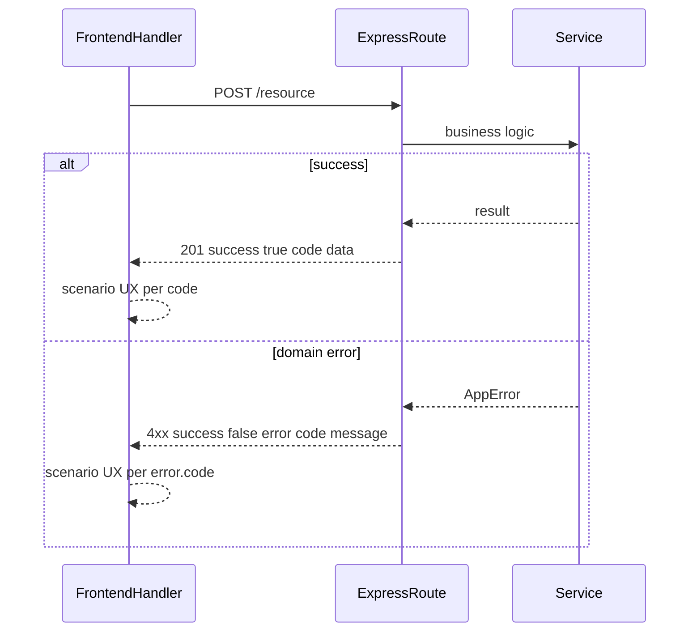

# Code Style

**Integration:** Implements specs from `project/documents/` and design from `project/design/` per TASK Plan ref + Spec ref. Paths from `project/PROJECT-INFRASTRUCTURE.md`. See [`RULES.md`](RULES.md).

Related: [`PLAN.md`](PLAN.md), [`TASK.md`](TASK.md), [`DESIGN.md`](DESIGN.md), [`DOCUMENT.md`](DOCUMENT.md), [`GREENFIELD.md`](GREENFIELD.md), [`BROWNFIELD.md`](BROWNFIELD.md), [`OVERVIEW.md`](OVERVIEW.md), [`INFRASTRUCTURE.md`](INFRASTRUCTURE.md), [`HISTORY.md`](HISTORY.md), [`../HELMSMAN-AGENT.md`](../HELMSMAN-AGENT.md).

How agents must write and document code. **Read-only template** — project stack and paths are in [`project/PROJECT-INFRASTRUCTURE.md`](project/PROJECT-INFRASTRUCTURE.md) (from greenfield clarify or brownfield discovery).

**Brownfield:** adapt to existing patterns; apply CODE conventions on **new or touched** code unless the user requests alignment. **Greenfield:** scaffold per section 9 when creating new apps under `platforms/`.

**Production-grade default:** Per [`RULES.md`](RULES.md) §5. No stubs unless user explicitly requests MVP.

**Re-read this file** at the start of **every task** that touches application source — per [`RULES.md`](RULES.md) §8. Record sections re-read in the task **Context read**.

## 0. Scope — all languages

This file is **not JavaScript-only**. It applies to **every language and stack** documented in `project/PROJECT-INFRASTRUCTURE.md` that supports block and line comments.

| Rule | Detail |
|------|--------|
| **Applies to** | TypeScript, JavaScript, Go, Python, Rust, Java, C#, Kotlin, PHP, Ruby, and any similar language |
| **Structure** | Block index (**summary + Additional**) + **context inline journal** per §2.3 in every language |
| **Syntax** | Adapt block and line comment delimiters per language (table below) |
| **When** | Re-read §1–2 before every coding task; add §8, §9, §11, §16 when API/auth/CRUD in scope |

### Comment syntax by language

| Language | Block (index above declaration) | Line journal (context prefixes; §2.3) |
|----------|--------------------------------|----------------------------------------|
| TS / JS | `/** ... */` | `// Param:` / `// Guard:` / `// Branch:` / `// Var:` / `// Step:` |
| Go | `/* ... */` or consecutive `//` lines above func | `// Param:` / `// Return:` / `// Var:` / `// Step:` |
| Python | `""" ... """` docstring | `# Input:` / `# Guard:` / `# Var:` / `# Step:` |
| Rust / Java / C# / C++ | `/**` or `///` per project style | `// Param:` / `// Guard:` / `// Var:` / `// Step:` |
| Ruby | `#` lines or `=begin` / `=end` block above method | `# Param:` / `# Var:` / `# Step:` |
| PHP | `/** ... */` or `#` block above | `// Param:` / `// Step:` or `# Var:` per file style |

Use the **project's existing comment style** when brownfield; never skip the index + journal pattern because the stack is not TypeScript.

Every non-trivial function, route handler, service method, client-side API handler, and **UI component with business logic** (React, Vue, Svelte, etc.) gets:

1. A structured **block comment** above the declaration — the **index** (summary line + optional `Additional`)
2. **Inline journal comments** in the body — context prefixes from §2.3 (`Param:`, `Guard:`, `Branch:`, etc.; fall back to `Var:` / `Step:`) at the point each binding or step appears

Every API request must return a proper HTTP status, JSON envelope with a **response `code`**, and on the frontend handlers must cover **all scenarios** with the correct UX (Alert, redirect, modal, etc.) — see section 8.

UI styling: [`project/PROJECT-DESIGN.md`](project/PROJECT-DESIGN.md) index + [`project/design/`](project/design/) detail files per [`DESIGN.md`](DESIGN.md). Structure and workflow: [`HELMSMAN-AGENT.md`](../HELMSMAN-AGENT.md).

## 1. Block Comment Template

Place a block comment immediately above the function, method, or handler. It is the **index** — what the entry point does and integration context. **Bindings and steps are documented only in the body** as inline journal comments (see section 2). The summary line may use `Function:`, `Route:`, `Handler:`, or `Component:` per §2.3.

```
/**
 * Function:  <one-line summary of what this entry point does>
 *             <HTTP method and path, if applicable>
 * Additional:
 *   - <integration notes, auth rules, content types, side effects, etc.>
 */
```

### Field rules

| Field | Required | Purpose |
|-------|----------|---------|
| **Summary** | Yes | What the code does. Use `Function:` (default), `Route:` (HTTP handlers), `Handler:` (client API handlers), or `Component:` (UI) per §2.3. Include route/method for API handlers. |
| **Additional** | When relevant | Auth, audience, response format, packages used, edge cases, response scenarios. |

## 2. Inline journal comments (all languages)

The function body is the **journal** — annotate bindings and steps **where they appear**, like footnotes in a reference work. Use the line-comment prefix for your language (§0). Pick prefixes from the **approved vocabulary** (§2.3); fall back to `Var:` and `Step:` when context is mixed or unclear.

### 2.1 Bindings

TypeScript / JavaScript / Go / Rust / Java / C#:

```typescript
// Param: <name> — <source>; <description>   // route params, body, query
// Prop: <name> — <source>; <description>    // React/Vue props
// Input: <name> — <source>; <description>   // service method args
// Var: <name> — <source>; <description>     // locals and general fallback
```

Python / Ruby:

```python
# Param: / # Prop: / # Input: / # Var: — same pattern as above
```

Rules:
- One binding journal line per meaningful parameter, prop, or local at **first declaration** or first meaningful use
- Prefer context-specific prefixes (`Param:`, `Prop:`, `Input:`) over `Var:` when the table in §2.3 applies
- Order in the body follows code flow

### 2.2 Steps

TypeScript / Go / etc.:

```typescript
// Step: <what this step does>       // general procedure (default)
// Guard: <check or early return>    // auth, validation, permission
// Branch: <outcome → UX action>     // frontend if on error.code
// Effect: <side effect>              // notify, revalidate, persist
// Return: <response or redirect>     // res.json, c.JSON, router.push on success path
// Throws: <domain error>             // before throw new AppError(...)
```

Python:

```python
# Step: / # Guard: / # Branch: / # Effect: / # Return: / # Throws: — same pattern
```

Rules:
- One step journal line **immediately before** each logical step the body implements
- Prefer context-specific prefixes from §2.3 over generic `Step:`
- **Never** skip a step (e.g. validation must have `Guard:` or `Step:` even when it shares a line with parsing)
- Missing inline binding or step journal in the body = **non-compliant**

### 2.3 Context vocabulary (default)

Pick prefixes by code type. `Function:` and `Var:` / `Step:` remain valid fallbacks everywhere.

| Code type | Block summary (preferred) | Inline bindings (preferred) | Inline steps (preferred) |
|-----------|---------------------------|----------------------------|-------------------------|
| Any (default) | `Function:` | `Var:` | `Step:` |
| HTTP route handler | `Route:` | `Param:` | `Guard:`, `Step:`, `Return:` |
| Service / business logic | `Function:` | `Input:` | `Step:`, `Throws:`, `Effect:` |
| Server action | `Function:` | `Var:` | `Guard:`, `Step:`, `Effect:` |
| Client API handler | `Handler:` | `Var:` | `Step:`, `Branch:`, `Effect:` |
| UI component | `Component:` | `Prop:` | `Step:` |

### 2.4 Free-form prefixes (when vocabulary does not fit)

Agents may use any clear single-word `Prefix:` when no §2.3 row fits (e.g. `Retry:`, `Cache:`).

- Prefix must be one English word + colon
- Compliance still requires block summary + inline journal — custom labels replace vocabulary picks, not the annotation requirement
- If unusual, add one line under block `Additional:` explaining the custom prefix

### 2.5 Go example (handler)

```go
/*
 * Route: List files for the authenticated user.
 *        GET /api/files
 */
func ListFiles(c *gin.Context) {
    // Param: userId — auth middleware; caller's user ID
    userId := c.GetString("userId")
    // Step: query non-deleted files for userId
    // Var: files — query result returned to client
    files, err := fileRepo.ListByUser(c, userId)
    // Return: JSON list with pagination metadata
    c.JSON(200, gin.H{"success": true, "data": files})
}
```

Trivial one-liners may omit the block comment and inline journal.

## 3. API Route Example (Express / TypeScript)

```typescript
/**
 * Route: Withdraw a team invitation.
 *        DELETE /api/invitations/:invitationId/withdraw
 * Additional:
 *   - Requires authenticated employee session
 *   - Returns JSON { success, code, data } or standard error envelope with error.code
 */
router.delete(
  '/:invitationId/withdraw',
  async (req: AuthRequest, res: Response, next: NextFunction) => {
    try {
      // Param: invitationId — path parameter; ID of the invitation to withdraw
      const { invitationId } = req.params;
      // Param: body — JSON body (WithdrawInvitationDto); optional reason
      const body = req.body as WithdrawInvitationDto;

      // Guard: verify caller belongs to the team that owns the invitation
      // Var: invitation — loaded invitation record
      const invitation = await invitationService.findById(invitationId);
      // Var: req.user — authenticated caller from auth middleware
      if (!invitation || !await teamService.isMember(req.user.id, invitation.teamId)) {
        throw new ForbiddenError('You do not have access to this invitation');
      }

      // Step: delegate to withdraw service
      // Var: result — withdraw service result returned to client
      const result = await invitationService.withdraw(req.user.id, invitationId, body);
      // Return: success envelope with code INVITATION_WITHDRAWN
      return res.json({ success: true, code: 'INVITATION_WITHDRAWN', data: result });
    } catch (error) {
      next(error);
    }
  }
);
```

## 4. Service / Business Logic Example

```typescript
/**
 * Function:  Withdraw a pending invitation and notify the invitee.
 * Additional:
 *   - Runs inside a DB transaction
 *   - Idempotent if invitation is already withdrawn
 */
async function withdraw(
  callerId: string,
  invitationId: string,
  dto: WithdrawInvitationDto
): Promise<Invitation> {
  return db.transaction(async (tx) => {
    // Input: callerId — ID of the employee performing the withdraw
    // Input: invitationId — ID of the invitation record
    // Input: dto — optional reason and metadata
    // Step: load invitation; reject if not found or not pending
    // Var: invitation — loaded invitation row
    const invitation = await tx.invitation.findUnique({ where: { id: invitationId } });
    // Throws: not found when invitation missing
    if (!invitation) throw new NotFoundError('Invitation not found');
    // Throws: conflict when invitation is not pending
    if (invitation.status !== 'pending') throw new ConflictError('Invitation is not pending');

    // Step: update status to withdrawn and persist
    // Var: updated — persisted invitation after status change
    const updated = await tx.invitation.update({
      where: { id: invitationId },
      data: { status: 'withdrawn', reason: dto.reason, withdrawnBy: callerId },
    });

    // Effect: send notification to the invitee
    await notificationService.sendWithdrawNotice(updated);

    return updated;
  });
}
```

## 5. Next.js Server Action Example

```typescript
/**
 * Function:  Server action to create a new project for the active team.
 * Additional:
 *   - Called from web UI only; not for external integrations
 *   - Revalidates /dashboard/projects after success
 */
export async function createProject(formData: FormData) {
  // Guard: parse and validate form fields
  // Var: formData — FormData from client; name, description, teamId
  // Var: parsed — validated fields from formData
  const parsed = createProjectSchema.safeParse({
    name: formData.get('name'),
    description: formData.get('description'),
    teamId: formData.get('teamId'),
  });
  if (!parsed.success) throw new ValidationError(parsed.error);

  // Guard: verify session user is a member of the team
  // Var: session — authenticated session
  const session = await getSession();
  if (!session || !await teamService.isMember(session.userId, parsed.data.teamId)) {
    throw new ForbiddenError('Not a team member');
  }

  // Step: create project via projectService
  // Var: project — created project record
  const project = await projectService.create(session.userId, parsed.data);
  // Effect: revalidate projects list cache
  revalidatePath('/dashboard/projects');
  return project;
}
```

## 6. React Presentational Component Example

Pure display components with no API calls or business logic. Block comments are still required when logic spans multiple steps.

```typescript
/**
 * Component:  Dashboard card showing team KPI with premium gold highlight when target is met.
 * Additional:
 *   - Follow project/PROJECT-DESIGN.md KPI card spec (gold left accent when target met)
 */
export function KpiCard({ title, value, target }: KpiCardProps) {
  // Prop: title — metric label
  // Prop: value — current numeric value
  // Prop: target — goal threshold for gold accent
  // Step: determine whether value meets or exceeds target
  // Var: targetMet — whether value meets or exceeds target
  const targetMet = value >= target;

  // Step: render metric card with appropriate accent styling
  return (
    <div className={cn('kpi-card', targetMet && 'kpi-card--gold')}>
      <span className="kpi-card__title">{title}</span>
      <span className="kpi-card__value">{value}</span>
    </div>
  );
}
```

## 7. Frontend Client Handler / Page Example

Client pages and handlers that call the API need the same block-comment **and inline journal** discipline as backend code. Document every response scenario in block `Additional` and implement with inline `Branch:` / `Guard:`; use `@/components/Alert` for inline feedback (see section 8).

### When frontend block comments are required

- Client event handlers that call the API (`handleSubmit`, `handleRun`, `load`, etc.)
- Custom hooks with business logic
- **Not required** for pure presentational components (see section 6)

```typescript
"use client";

import { FormEvent, useEffect, useState } from "react";
import { useRouter } from "next/navigation";
import { apiFetch, apiPost } from "@/lib/api";
import { Alert } from "@/components/Alert";
import { Button } from "@/components/Button";
import { Input } from "@/components/Input";

/**
 * Function:  Client page to create a company and chief assistant.
 * Additional:
 *   - Uses apiPost from @/lib/api
 *   - Scenarios: UNAUTHORIZED → redirect; validation/server errors → Alert; create success → redirect (no success Alert)
 */
export default function NewCompanyPage() {
  const router = useRouter();
  const [companyName, setCompanyName] = useState("");
  const [assistantName, setAssistantName] = useState("");
  const [error, setError] = useState("");
  const [loading, setLoading] = useState(false);

  /**
   * Handler: Load session and redirect unauthenticated users.
   */
  async function load() {
    // Step: fetch GET /auth/me
    // Var: res — GET /auth/me response envelope
    const res = await apiFetch<{ user: { id: string } | null }>("/auth/me");
    // Branch: UNAUTHORIZED or no user → redirect /login; other error codes → error Alert
    if (!res.success) {
      if (res.error?.code === "UNAUTHORIZED") {
        router.push("/login");
        return;
      }
      setError(res.error?.message ?? "Failed to verify session");
      return;
    }
    if (!res.data?.user) router.push("/login");
  }

  useEffect(() => {
    load();
  }, [router]);

  /**
   * Handler: Create company and chief assistant via API.
   */
  async function handleSubmit(e: FormEvent) {
    // Var: e — form submit event
    e.preventDefault();
    setLoading(true);
    setError("");

    // Step: clear prior alerts and POST /companies with company name
    // Var: companyRes — POST /companies response envelope
    const companyRes = await apiPost<{ company: { id: string } }>("/companies", {
      name: companyName,
    });
    // Branch: on failure, branch by error.code — VALIDATION_FAILED or other → error Alert
    if (!companyRes.success || !companyRes.data?.company) {
      setError(companyRes.error?.message ?? "Failed to create company");
      setLoading(false);
      return;
    }

    // Step: POST chief assistant
    // Var: assistantRes — POST chief assistant response envelope
    const assistantRes = await apiPost<{ agent: unknown }>(
      `/companies/${companyRes.data.company.id}/assistant`,
      { assistantName }
    );
    setLoading(false);

    // Branch: assistant failure → error Alert; success → redirect
    if (!assistantRes.success) {
      setError(assistantRes.error?.message ?? "Failed to create assistant");
      return;
    }

    // Return: redirect to company detail on success
    router.push(`/companies/${companyRes.data.company.id}`);
  }

  return (
    <form onSubmit={handleSubmit} className="space-y-4">
      <Input label="Company Name" value={companyName} onChange={(e) => setCompanyName(e.target.value)} required />
      <Input label="Chief Assistant Name" value={assistantName} onChange={(e) => setAssistantName(e.target.value)} required />
      <Alert variant="error">{error}</Alert>
      <Button type="submit" disabled={loading}>
        {loading ? "Creating..." : "Create Company"}
      </Button>
    </form>
  );
}
```

## 8. Request Feedback Rule

Applies to **every** user-initiated or page-critical API request (fetch, create, update, delete, run). Backend responses must include HTTP status, JSON envelope, and a **response `code`**. Frontend handlers must handle **every scenario** with the correct UX action.

### Backend (required)

All routes return a JSON envelope matching the frontend `ApiResponse<T>` type:

```typescript
// Success
{ success: true, code: string, data: T }                    // HTTP 200 or 201

// Failure
{ success: false, error: { code: string, message: string } }  // HTTP 4xx or 5xx
```

| Case | HTTP status | Body |
|------|-------------|------|
| Success (read) | `200` | `{ success: true, code, data }` |
| Success (create) | `201` | `{ success: true, code, data }` |
| Validation / domain error | `400`–`409` via `AppError` | `{ success: false, error: { code, message } }` |
| Auth failure | `401` | `{ success: false, error: { code, message } }` |
| Not found | `404` | `{ success: false, error: { code, message } }` |
| Unexpected | `500` | `{ success: false, error: { code, message } }` |

Rules:
- `code` is **required** on every response — stable machine-readable identifier in **SCREAMING_SNAKE_CASE** (e.g. `TODO_CREATED`, `VALIDATION_FAILED`, `UNAUTHORIZED`, `NOT_FOUND`)
- Namespace by domain when helpful (`AUTH_UNAUTHORIZED`, `TODO_NOT_FOUND`)
- Success codes describe the operation outcome (`COMPANY_CREATED`, `SETTINGS_UPDATED`, `TODO_LIST_FETCHED`)
- `AppError` (or stack equivalent) carries `code` + `message`; `errorHandler` always emits both in the envelope
- Route handlers call `next(error)` for failures — never swallow errors or return `200` with `success: false` unless the HTTP status also reflects failure
- Use `res.status(201).json({ success: true, code: 'COMPANY_CREATED', data })` for creates
- Document response codes in route block comment `Additional` and in `project/documents/{feature}/api-specification-document.md` when the feature has an API spec

```typescript
/**
 * Route: Create a new company for the authenticated user.
 *        POST /companies
 * Additional:
 *   - Success code: COMPANY_CREATED
 *   - Error codes: VALIDATION_FAILED, UNAUTHORIZED (via errorHandler)
 *   - Errors delegated to errorHandler via next(error)
 */
router.post('/', async (req: AuthRequest, res: Response, next: NextFunction) => {
  try {
    // Guard: validate request body with zod schema
    // Var: parsed — req.body validated by companySchema; company name
    const parsed = companySchema.safeParse(req.body);
    if (!parsed.success) throw new ValidationError('Company name is required');

    // Step: create company via companyService
    // Var: company — persisted company record for req.user
    const company = await createCompany(req.user!.id, parsed.data.name);

    // Return: 201 with success envelope and code COMPANY_CREATED
    res.status(201).json({ success: true, code: 'COMPANY_CREATED', data: { company } });
  } catch (error) {
    next(error);
  }
});
```

### Frontend (required)

For every `apiFetch`, `apiPost`, `apiPut`, or SSE run:

1. **Always** check `res.success` (or `catch` thrown errors for SSE)
2. **Branch on `res.code` or `res.error?.code`** when UX differs by scenario
3. **On failure** — apply the scenario action below; default to `<Alert variant="error">` with `res.error?.message`
4. **On mutation success** — apply success scenario (Alert, redirect, modal close, list refresh)
5. **On load failure** — never leave the page stuck on "Loading..." silently
6. **Clear** previous alert state at the start of each request

Use `@/components/Alert` for inline feedback — not `window.alert` and not ad-hoc `<p className="text-[var(--text-error)]">` in new code.

### Frontend scenario handling (required)

Every client handler (`load`, `handleSubmit`, `handleDelete`, etc.) must define what happens for **each** outcome **before** coding. List high-level scenarios in block comment **Additional**, then implement every branch with `// Branch:` or `// Guard:` at each branch (e.g. before `router.push`, before `setError`).

| Scenario | Typical `code` / condition | UX action |
|----------|--------------------------|-----------|
| Success, user stays on page | `success: true` | Success `Alert` or silent refresh |
| Success, navigation expected | `success: true` | `router.push` / redirect — success Alert optional |
| Validation error | `VALIDATION_FAILED`, 400 | Error `Alert`; inline field errors if form |
| Unauthorized | `UNAUTHORIZED`, 401 | Redirect to `/login` |
| Forbidden | `FORBIDDEN`, 403 | Error `Alert`; stay on page |
| Not found (detail load) | `NOT_FOUND`, 404 | Redirect to index or dedicated not-found page |
| Conflict | `CONFLICT`, 409 | Error `Alert`; keep form data |
| Server / network error | 500 or fetch throws | Error `Alert`; end loading state |
| Delete success | `success: true` | Close confirmation modal; refresh list; optional success Alert |

Rules:
- Never leave loading spinners running after any terminal outcome
- Never silently ignore a failed response
- Use `ConfirmModal` for destructive confirm — not `window.confirm`
- Redirect only when the scenario table or block `Additional` says so — document why

```typescript
const router = useRouter(); // next/navigation
const [error, setError] = useState("");
const [message, setMessage] = useState("");

/**
 * Handler: Save LLM settings from the settings form.
 */
async function handleSave(e: FormEvent) {
  // Var: e — form submit event
  e.preventDefault();
  setError("");
  setMessage("");

  // Step: clear alerts and PUT /settings/llm
  // Var: payload — form fields for LLM settings
  // Var: res — PUT /settings/llm response envelope
  const res = await apiPut<{ settings: unknown }>("/settings/llm", payload);
  // Branch: UNAUTHORIZED → redirect /login; VALIDATION_FAILED/other → error Alert
  if (!res.success) {
    if (res.error?.code === "UNAUTHORIZED") {
      router.push("/login");
      return;
    }
    setError(res.error?.message ?? "Failed to save settings");
    return;
  }
  // Effect: success → success Alert (user stays on page)
  setMessage("Settings saved.");
}

// In JSX:
<Alert variant="error">{error}</Alert>
<Alert variant="success">{message}</Alert>
```



## 9. Framework Scaffold Rule (greenfield)

**Greenfield only** — per [`GREENFIELD.md`](GREENFIELD.md). **Never bootstrap a new app from scratch.** When creating a new app under `platforms/`, use the framework's **official starter/scaffold command** — do not hand-roll folder structure, config, or boilerplate.

**Brownfield:** do not re-scaffold existing apps; extend code in place per [`BROWNFIELD.md`](BROWNFIELD.md).

### Workflow

1. **Identify the framework** from [`project/PROJECT-INFRASTRUCTURE.md`](project/PROJECT-INFRASTRUCTURE.md)
2. **Look up the official scaffold command** for that framework and version
3. **Run it** targeting the correct `platforms/<app>/` path (document non-obvious commands in project)
4. **Customize** generated output only where the project requires it
5. **Document** the scaffold choice in `project/histories/` when bootstrapping a new app

### Example scaffolds (illustrative — search fresh each time)

| Framework | Official scaffold | Example |
|-----------|-------------------|---------|
| Rails | `rails new` | `rails new platforms/api --api` |
| Next.js | `create-next-app` | `npx create-next-app@latest platforms/web` |
| NestJS | `nest new` | `nest new platforms/api` |
| Go (Gin) | `go mod init` + framework layout | `platforms/<api-slug>/` per [`GREENFIELD.md`](GREENFIELD.md) |
| golang-migrate | `migrate` CLI | `migrate create -ext sql -dir platforms/api/migrations` |
| GORM | official docs | Postgres driver + models in `internal/models/` |
| Express (Node) | `express-generator` or framework docs | per project |
| Laravel | `laravel new` | `laravel new platforms/api` |

### When manual bootstrap is allowed

- No official scaffold exists for the chosen stack
- Scaffold exists but cannot meet a documented PROJECT constraint — note why in history
- Extending an already-scaffolded app (not creating a new one)

### Auth scaffold (frontend and backend)

**Never hand-roll authentication** when the stack has a popular official or de-facto auth scaffold/starter.

Applies to frontend and backend apps as documented in `project/PROJECT-INFRASTRUCTURE.md`. Auth is cross-cutting, but each app installs and integrates its own auth layer.

#### Workflow

1. **Read the stack** from [`project/PROJECT-INFRASTRUCTURE.md`](project/PROJECT-INFRASTRUCTURE.md)
2. **Search** for the framework's recommended auth scaffold or starter — official docs first
3. **Run scaffold/install** in the correct app path (per `project/PROJECT-INFRASTRUCTURE.md`) before writing custom auth code
4. **Customize** only where PROJECT requires it
5. **Document** the auth scaffold choice in block comment `Additional` and `project/histories/`

#### Example auth scaffolds (illustrative — search fresh each time)

| Stack | Direction |
|-------|-----------|
| Next.js (App Router) | Auth.js / NextAuth.js scaffold |
| NestJS | `@nestjs/passport` + official auth module patterns |
| Go (Gin) | JWT middleware (`golang-jwt/jwt`) + bcrypt — search Gin auth patterns |
| Express | Passport.js or framework-adjacent starter |
| Rails API | Devise / devise-jwt |
| Laravel | Breeze, Fortify, or Sanctum per use case |

#### When manual auth is allowed

- No suitable scaffold after documented search — note why in history
- Highly custom auth requirements no starter covers

Auth libraries still follow the **Package-First** rule: run install in the correct app directory per `project/PROJECT-INFRASTRUCTURE.md` **before** writing imports.

## 10. Package-First Rule

**Never hand-roll a solved problem.** Before writing custom code for a common capability, search npm and prefer the most popular, well-maintained package that fits the project stack (see [`project/PROJECT-INFRASTRUCTURE.md`](project/PROJECT-INFRASTRUCTURE.md)).

**Install before import.** Run the stack's package install in the correct app directory per `project/PROJECT-INFRASTRUCTURE.md` and confirm success **before** writing any `import` from that package.

### Workflow

1. **Identify the capability** — pagination, icons, dates, validation, auth, file upload, etc.
2. **Search npm** — web search, [npmjs.com](https://www.npmjs.com), or `npm search`
3. **Evaluate candidates** using criteria below
4. **Install via npm** in the correct platforms app — run in terminal first:

```bash
cd platforms/<app> && npm install <package>
```

5. **Then write** thin integration code with imports — only after install succeeds
6. **Document** package choice in block comment `Additional`

### Evaluation criteria

| Criterion | Guidance |
|-----------|----------|
| Popularity | High weekly download counts |
| Maintenance | Recent releases, active repo |
| Stack fit | Compatible with this project's stack |
| Bundle size | Reasonable for the feature (especially frontend) |
| License | MIT/Apache or compatible |

### Example capabilities (search fresh each time)

| Feature | Search for | Typical direction |
|---------|------------|-------------------|
| Icons | `react icons npm` | `lucide-react`, `react-icons` |
| Pagination / tables | `react table pagination npm` | `@tanstack/react-table` |
| UI components | `react component library shadcn mui` | shadcn/ui, Radix, MUI — see [`DESIGN.md`](DESIGN.md) component library first |
| Forms + validation | `zod react hook form npm` | `react-hook-form` + `zod` |
| Dates | `date-fns npm` | `date-fns` or `dayjs` |
| API validation | `zod express npm` | `zod` |
| ORM / DB | `prisma postgresql npm` | `prisma` or project choice |

### When manual code is allowed

- No suitable package after documented search — note why in `Additional` or history entry
- Project-specific business logic no generic library covers
- Thin wrappers around an installed package
- Trivial one-liners — not full features

### Document package choice

```
 * Additional:
 *   - Uses @tanstack/react-table for pagination (chosen over manual implementation)
```

Use the app path from [`project/PROJECT-INFRASTRUCTURE.md`](project/PROJECT-INFRASTRUCTURE.md) (e.g. `platforms/web`, `backend/`, per project).

## 11. Entity, Soft Delete & CRUD Conventions

### UUID primary keys

- Every **persisted entity/table** uses a **UUID** primary key (`uuid` in PostgreSQL; UUID type in ORM schema)
- API routes use UUID in path params (e.g. `GET /api/todos/:id`)
- Do not use auto-increment integer IDs for domain entities unless the user explicitly opts out and it is documented in `project/PROJECT-INFRASTRUCTURE.md` + `project/histories/`

### Soft delete

- Every persisted entity includes **`deleted_at`** (nullable timestamp)
- **Delete** sets `deleted_at` to the current time — does not remove the row
- List, search, and detail queries **exclude** rows where `deleted_at` is set (unless an admin/trash feature is explicitly scoped)
- Hard delete only when the user explicitly requests it and it is documented

### Full CRUD (when the feature needs it)

**Trigger:** any feature that manages a named resource collection (todos, users, products, etc.) — if it feels like CRUD, build **all** of it. Do not ship create-only or list-only stubs.

**Backend API (per resource):**

| Operation | Endpoint pattern | Notes |
|-----------|------------------|-------|
| Index | `GET /api/{resource}` | Query params: `search`, `filter`, `sort`, `page`, `pageSize` |
| Detail | `GET /api/{resource}/:id` | UUID param; 404 if missing or soft-deleted |
| Create | `POST /api/{resource}` | Returns 201 + envelope with success `code` |
| Update | `PUT` or `PATCH /api/{resource}/:id` | Returns envelope with success `code` |
| Delete | `DELETE /api/{resource}/:id` | Soft delete; returns success envelope with `code` |

Use package-first for pagination/tables (section 10 — e.g. `@tanstack/react-table`).

**Frontend pages (per resource):**

| Page | Required UI |
|------|-------------|
| **Index** | List/table with **filter**, **search**, **sort**, **pagination** |
| **Create** | Form page or modal flow |
| **Edit** | Form page pre-filled from API |
| **Detail** | Read-only view of one record |
| **Delete** | Button on index and/or detail → **confirmation modal** (see [`DESIGN.md`](DESIGN.md)) |

- Add any **additional pages** the feature needs (bulk actions, trash/restore, import, etc.) — document in `project/documents/{feature}/`
- Delete confirmation: shared `ConfirmModal` / dialog component — **not** `window.confirm`, **not** `window.alert` (same bar as section 8 `Alert` rule)

## 12. General Coding Rules

This is the quick recap; detail lives in the sections cited.

- **Scaffold-first** (§9) — bootstrap new apps via official starters; never hand-roll boilerplate.
- **Auth scaffold-first** (§9) — use a popular auth starter on frontend and backend; never hand-roll auth when one exists.
- **Package-first / install-before-import** (§10) — search npm before common features; run install before writing the import.
- **Component library first** (web) — use popular UI primitives before hand-rolling ([`DESIGN.md`](DESIGN.md)).
- **Request feedback** (§8) — every API route returns HTTP status + envelope with required `code`; every frontend handler documents and implements all scenarios.
- **UUID PKs + soft delete + full CRUD** (§11) — UUID path params, `deleted_at` on every entity, complete index/create/edit/detail/delete with confirm modal.
- **Comment discipline** (§1–2) — block summary + `Additional` above declarations; inline journal (`Param:`/`Guard:`/`Branch:`/… per §2.3) in the body, in any language (§0).
- **TypeScript everywhere** in app packages — no untyped `any` unless unavoidable and noted in `Additional`.
- **Typed domain errors** in services, mapped to HTTP status in handlers.
- **Naming:** camelCase functions; PascalCase components/types. **Imports:** external → internal → relative. **No dead code.** Match neighboring file patterns.

## 13. Common mistakes to avoid

The rules above, stated as the failures they prevent:

- Hand-rolling something a scaffold, auth starter, or popular package already solves (§9, §10).
- Writing `import ... from '<package>'` before `npm install` succeeded in that app — leaving broken imports for the user.
- Putting bindings/steps only in the block comment — the **body** must carry the inline journal; never skip `Guard:`/`Step:` on validation, parsing, or auth checks; never let comments drift from the code.
- Omitting `code` from a response, returning `200` with `success: false`, or silently ignoring `!res.success` on the frontend.
- Using a generic error Alert when redirect/modal is the correct scenario; using `window.alert`/`window.confirm` instead of `@/components/Alert` and a confirmation modal ([`DESIGN.md`](DESIGN.md)).
- Auto-increment integer PKs for domain entities (without documented opt-out), hard-deleting by default, or shipping partial CRUD.
- Finishing a task while touched files still show linter/typechecker/IDE errors (§15).

## 14. Agent Checklist

1. New app bootstrapped via official starter; auth via a popular starter (§9) — neither hand-rolled?
2. npm searched and package installed **before** the first `import` from it; choice noted in `Additional` (§10)?
3. Block summary + `Additional` on every non-trivial function; bindings + steps annotated inline (`Param:`/`Guard:`/`Branch:`/…) with none skipped (§1–2)?
4. Every API route returns correct HTTP status + envelope with required `code` (§8)?
5. Every frontend handler documents scenarios in `Additional` and implements each via `Branch:`/`Guard:` (§8)?
6. Persisted entities use UUID PK + `deleted_at` soft delete; CRUD features ship full API + pages with delete confirm modal (§11)?
7. UI matches `project/design/` + `project/PROJECT-DESIGN.md`; paths/stack match `project/PROJECT-INFRASTRUCTURE.md`?
8. Post-edit verification (§15) run on all touched files/apps — zero linter/typechecker/IDE errors?
9. Greenfield/new backend API meets the production baseline (§16)?
10. All new/touched code meets the production bar — no stubs, partial CRUD, or unhandled scenarios unless the user asked for MVP?

## 15. Post-edit verification

**After every code edit**, verify zero errors before moving on or ending the turn. Do not leave linter, typechecker, compiler, or IDE diagnostics unresolved.

### Workflow (required)

1. **Read lints** on every file changed in the current task
2. **Run the app's verify command** in each affected app — use the lint/typecheck command in [`project/PROJECT-AGENTS.md`](project/PROJECT-AGENTS.md) (e.g. `npm run lint`, `go vet`, `cargo clippy`). If `project/PROJECT-AGENTS.md` does not list a command yet, document one there first.
3. **Fix all errors** in the same turn — missing imports, type errors, syntax errors, unused vars, etc.
4. **Re-run** until clean — repeat steps 1–2 after fixes
5. Only then mark the task complete or append history

### When to run

| Trigger | Action |
|---------|--------|
| After editing any source file in a platforms app | Run that app's verify command |
| After adding a function call | Confirm import or symbol exists |
| After multi-app changes | Verify each touched app |
| Before saying "done" | Full check on all changed files |

### Example (Node/TypeScript project)

Calling a function without importing it — caught by that app's typecheck command (e.g. `tsc --noEmit`). Other stacks use their own linter/typechecker per project.

## 16. Production baseline (API, greenfield)

Production security and ops bar (**required default**) for **new** APIs bootstrapped per [`GREENFIELD.md`](GREENFIELD.md). Apply when creating a backend under `platforms/<backend>/` (or equivalent path in `project/PROJECT-INFRASTRUCTURE.md`). **Brownfield:** apply to new endpoints and touched backends — not optional when adding API surface.

| Concern | Rule |
|---------|------|
| **Validation** | Project-appropriate validator on request bodies and path/query params |
| **Auth** | Protect all routes except `GET /health` and auth endpoints |
| **CORS** | Explicit allowlist from `CORS_ORIGIN` env — no wildcard in production |
| **Errors** | Central error handler → `{ success: false, error: { code, message } }` with correct HTTP status |
| **Logging** | Structured request logging — method, path, status, duration |
| **Health** | `GET /health` returns `200` with `{ success: true, code: 'HEALTH_OK', data: { db: 'ok' } }` when DB reachable |
| **Seeds** | Dev seed script creates sample user + domain data (`go run cmd/seed`, `prisma db seed`, or equivalent) |
| **Pagination** | Index list endpoints: default `page=1`, `limit=20`; support `search`, `sort`, `filter` query params |

### Do

- Register global validation pipe/middleware before route handlers
- Return `503` with `SERVICE_UNAVAILABLE` when health check fails DB connection
- Document env vars in the backend app's `.env.example` (path per `project/PROJECT-INFRASTRUCTURE.md`)

### Don't

- Don't expose stack traces or internal errors in API responses
- Don't leave list endpoints unbounded — always paginate
- Don't skip health endpoint — compose depends on it
- Don't ship endpoints without validation, auth (when required), pagination on lists, or central error handling
- Don't treat section 16 as optional for greenfield backends or new brownfield API endpoints
