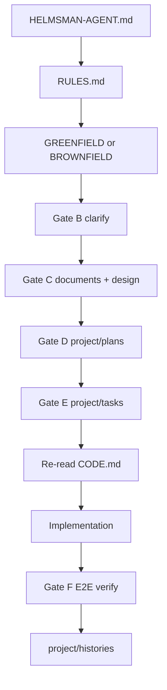

# Integrated Rules

**Read this second**, after [`../HELMSMAN-AGENT.md`](../HELMSMAN-AGENT.md). This is the rulebook: gates, production bar, E2E, and the code gate live here, and other files link to it. **Nothing in the pack is standalone** — every file connects: specs → blueprint → tasks → code → verify → history.

Templates: [`PLAN.md`](PLAN.md), [`TASK.md`](TASK.md), [`GREENFIELD.md`](GREENFIELD.md), [`BROWNFIELD.md`](BROWNFIELD.md), [`OVERVIEW.md`](OVERVIEW.md), [`INFRASTRUCTURE.md`](INFRASTRUCTURE.md), [`DOCUMENT.md`](DOCUMENT.md), [`DESIGN.md`](DESIGN.md), [`CODE.md`](CODE.md), [`HISTORY.md`](HISTORY.md). Terms: [`README.md`](README.md) glossary.

---

## 1. The integrated flow

| Layer | Path (inside `{pack}` unless noted) | Role |
|-------|------|------|
| Entry | `HELMSMAN-AGENT.md` | Mode + gate order + read order |
| Rulebook | `instructions/RULES.md` | This file — hard rules + links |
| Templates | `instructions/` | Read-only rules per domain |
| Specs | `project/documents/`, `project/design/` | What to build (Gate C) |
| Blueprint | `project/plans/*.md` | Platform inventory, phases, E2E matrix (Gate D) |
| Execution | `project/tasks/*.md` | One standalone exhaustive task per request (Gate E) |
| Config | `project/PROJECT-OVERVIEW.md`, `-INFRASTRUCTURE.md`, `-AGENTS.md`, `-DESIGN.md` | Project-specific map |
| Record | `project/histories/` | What was done + verify results (after Gate F) |
| App runtime | `{root}/platforms/`, `{root}/deploy/` | Greenfield app — **not** inside `{pack}` |

**Integration rule:** every TASK step carries **Plan ref + Spec ref + Code ref** (Code ref when touching application source). Every HISTORY entry links plan, task, specs, and CODE compliance when applicable.

### 1.1 Pack isolation (reminder)

Canonical detail: [`../HELMSMAN-AGENT.md`](../HELMSMAN-AGENT.md) §0. In short: the pack lives at `{root}/helmsman-agent/` and is **used in place** — read and write inside `{pack}`, build the app at `{root}`, and **never copy, move, or flatten the pack into `{root}`** (the thin `{root}/AGENTS.md` from [`templates/root-AGENTS.md`](../templates/root-AGENTS.md) is the only allowed exception). Paths `project/` and `instructions/` mean inside `{pack}` unless prefixed `{root}/`.

---

## 2. Execution gates A–F (canonical)

Sequential — do not skip or reorder. The entry file (§1.5) carries a one-line reminder; this is the full table.

| Gate | Requirement | Blocks |
|------|-------------|--------|
| **A — Read-first** | [`HELMSMAN-AGENT.md`](../HELMSMAN-AGENT.md) §1.4 Phases 1–3 full read + Phase 4 `project/` scan — **every session**, not bootstrap-only; run the HARD STOP re-entry first; `{root}/AGENTS.md` present with Helmsman sections (copy/merge from [`templates/root-AGENTS.md`](../templates/root-AGENTS.md) if missing) | `platforms/`, `deploy/`, app source, Dockerfiles |
| **B — Clarify and record** | Resolve open decisions; write `project/PROJECT-OVERVIEW.md` per [`OVERVIEW.md`](OVERVIEW.md), then `PROJECT-INFRASTRUCTURE.md`, `PROJECT-AGENTS.md`, `PROJECT-DESIGN.md`. **Brownfield fresh adoption:** repo discovery + core `project/*` + `project/documents/repo/` per [`BROWNFIELD.md`](BROWNFIELD.md) §0.1–§2 — blocks all implementation (including a parked request) until done | Implementation |
| **C — Documents and design** | `project/documents/{feature}/`; `project/design/` + `project/PROJECT-DESIGN.md` index when web UI is in scope | Scaffold, `platforms/`, `deploy/` |
| **D — Blueprint plan** | `project/plans/{timestamp}_{slug}.md` per [`PLAN.md`](PLAN.md) — required for every non-trivial task | TASK file, implementation |
| **E — Task before code** | One standalone exhaustive `project/tasks/...` with Application map and file-level steps per [`TASK.md`](TASK.md); Plan + Spec + Code refs; re-read [`CODE.md`](CODE.md) + active task each work block | Application edits |
| **F — Quality + E2E** | Production bar (§5) + E2E verification (§6) before marking complete | Task / bootstrap complete |

**Non-trivial** = touches app source, `platforms/`, `deploy/`, db, docker, or multi-file config. Trivial typo-only edits skip PLAN and TASK.

**Exception:** pack maintenance (`instructions/`, `HELMSMAN-AGENT.md`, tracked `project/*/README.md`).

---

## 3. Platform model (greenfield)

All runnable units live under `{root}/platforms/` (plural). Two kinds — **service** (`postgresql`, `minio`, `redis`) and **application** (`web`, `api`, `worker`). **Service platforms and `deploy/docker-compose.yml` come before application scaffold.** Migrations live inside the backend app, not the service folder.

Record every slug in `project/PROJECT-INFRASTRUCTURE.md` and the Gate D plan **platform inventory** table. Full model, layout rules, and the inventory table: [`GREENFIELD.md`](GREENFIELD.md) §1; plan template: [`PLAN.md`](PLAN.md).

---

## 4. Doc layers (how they link)

| Layer | When | Links to |
|-------|------|----------|
| `project/documents/` | Before code (Gate C) | PLAN phases, TASK spec refs |
| `project/design/` | Before UI (Gate C) | PLAN, TASK, CODE, DESIGN |
| `project/plans/` | Before TASK (Gate D) | documents, design, INFRASTRUCTURE |
| `project/tasks/` | Before code (Gate E) | plan, documents, design |
| `project/histories/` | After work | plan, task, documents, E2E results |

---

## 5. Production bar (hard default)

**Production-ready unless the user explicitly asks for MVP.** No stubs, skeleton UIs, or dev-only infra when deploy is in scope. This is the canonical statement — domain files point here.

| Domain | Read | Expectation |
|--------|------|-------------|
| UI / UX | [`DESIGN.md`](DESIGN.md) + `project/design/` | Responsive per `project/PROJECT-DESIGN.md`; default neutral grayscale (light) when unspecified; usable on phone + desktop; loading/error/empty; accessible |
| Infrastructure | [`INFRASTRUCTURE.md`](INFRASTRUCTURE.md) + [`GREENFIELD.md`](GREENFIELD.md) | Healthchecks, backup, env examples, startup order |
| Code / API | [`CODE.md`](CODE.md) §1–2, §8, §11, §16 | Block summary + inline journal (CODE §2.3); full CRUD, response codes, validation |
| Specs | [`DOCUMENT.md`](DOCUMENT.md) | Production flows and error cases |
| Plans / tasks | [`PLAN.md`](PLAN.md), [`TASK.md`](TASK.md) | E2E verify in plan matrix and task steps |
| Change log | [`HISTORY.md`](HISTORY.md) | State production bar met, or list gaps |

---

## 6. E2E verification (Gate F)

Required when compose or deploy exists. Record results in the task **Task completion checklist** and `project/histories/`.

**Local cycle:** `docker compose -f deploy/docker-compose.yml up -d --build` → wait for healthchecks (services → migrations → apps) → smoke-test documented flows → `docker compose down`.

**Deploy cycle (greenfield bootstrap):** `docker build` every platform image → `docker save` to `deploy/platforms/<slug>/` ([`GREENFIELD.md`](GREENFIELD.md) §3) → `docker load` → `docker compose up` → smoke-test again.

The TASK final phase uses **explicit steps per check** — never one vague "verify everything" step.

---

## 7. Domain index — when to read what

| You need… | Read |
|-----------|------|
| Pack isolation (use in place) | [`../HELMSMAN-AGENT.md`](../HELMSMAN-AGENT.md) §0 |
| Root guide (`{root}/AGENTS.md`) | [`templates/root-AGENTS.md`](../templates/root-AGENTS.md) |
| Mode, clarify, gate order, read order | [`../HELMSMAN-AGENT.md`](../HELMSMAN-AGENT.md) |
| Terminology / glossary / index | [`README.md`](README.md) |
| Bootstrap blueprint | [`PLAN.md`](PLAN.md) → `project/plans/` |
| File-level exhaustive steps | [`TASK.md`](TASK.md) → `project/tasks/` |
| New app, `platforms/`, Docker, deploy | [`GREENFIELD.md`](GREENFIELD.md) |
| Existing repo / fresh adoption | [`BROWNFIELD.md`](BROWNFIELD.md) (onboarding: §0.1) |
| Doc architecture, folder tree | [`INFRASTRUCTURE.md`](INFRASTRUCTURE.md) |
| Feature specs | [`DOCUMENT.md`](DOCUMENT.md) |
| UI design system | [`DESIGN.md`](DESIGN.md) |
| Code style, API, CRUD — re-read every coding task | [`CODE.md`](CODE.md) |
| Change log | [`HISTORY.md`](HISTORY.md) |

---

## 8. Code gate (re-read CODE.md every coding task)

CODE.md is easy to skip when it appears only in the Gate A read list. This gate makes it **mandatory at task start**.

| Rule | Detail |
|------|--------|
| **When** | Start of every task that will touch application source (`platforms/`, `backend/`, `src/`, app packages, etc.) |
| **Re-read** | First session: full [`CODE.md`](CODE.md). Each new coding task: **§1–2 always**; plus §8 (API), §9 (auth), §11 (CRUD), §16 (API baseline) when in scope |
| **Record** | TASK **Context read** — `instructions/CODE.md — re-read §{list} for this task` |
| **Apply** | Block summary + `Additional:` + inline journal per CODE §2.3 (any language per CODE §0) |
| **Per step** | TASK implementation steps include a **Code ref** to CODE sections |
| **Verify** | CODE §14 checklist + §15 post-edit before task complete |

---

## 9. Agent checklist

1. Re-entry run this session; §1.4 Phases 1–3 + Phase 4 complete?
2. Instructions re-read and `project/` updated per gates before any application code edit?
3. Gates B–D complete (clarify, docs/design, plan) before TASK `in_progress`?
4. CODE.md re-read at task start when touching application source; sections in Context read?
5. Plan platform inventory lists every `platforms/<slug>`?
6. TASK has Application map + standalone exhaustive file-level steps; Files-expected-to-change matches steps?
7. CODE §1–2 applied on every touched source file?
8. Service platforms created before app scaffold (greenfield)?
9. Active task re-read this work block; step checklists complete ([`TASK.md`](TASK.md) §1.9)?
10. Gate F E2E (local + deploy when infra in scope) run?
11. Task completion checklist done before `Status: complete`?
12. HISTORY links plan, task, E2E, and CODE compliance when code touched?
