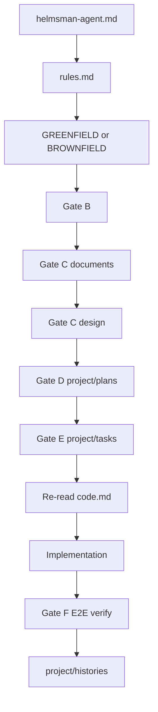

# Integrated Rules

**Read this second** — after [`../helmsman-agent.md`](../helmsman-agent.md), before domain files. **Nothing in this instruction set is standalone.** Every file connects: specs → blueprint → tasks → code → verify → history.

Related: [`plan.md`](plan.md), [`task.md`](task.md), [`greenfield.md`](greenfield.md), [`brownfield.md`](brownfield.md), [`infrastructure.md`](infrastructure.md), [`document.md`](document.md), [`design.md`](design.md), [`code.md`](code.md), [`history.md`](history.md).

---

## 1. Integrated system

| Layer | Path | Role |
|-------|------|------|
| Entry | `helmsman-agent.md` (inside `{pack}`) | Mode + gate order |
| Map | `instructions/rules.md` | This file — hard rules + links |
| Specs | `project/documents/`, `project/design/` | What to build (inside `{pack}`) |
| Blueprint | `project/plans/*.md` | Platform inventory, phases, E2E matrix → feeds TASK |
| Execution | `project/tasks/*.md` | **One standalone exhaustive** task per request — unlimited steps |
| Config | `project/overview.md`, `project/infrastructure.md`, `project/AGENTS.md`, `project/design.md` | Project-specific map (inside `{pack}`) |
| Record | `project/histories/` | What was done + verify results |
| App runtime | `{root}/platforms/`, `{root}/deploy/` | Greenfield scaffold — **not** inside `{pack}` |

**Integration rule:** Every TASK step needs **Plan ref**, **Spec ref**, and **Code ref** (when touching application source). Every HISTORY entry links plan, task, specs, and CODE compliance when applicable.

### 1.1 Pack isolation (helmsman-agent — use in place)

When this instruction repo lives at `{root}/helmsman-agent/` (folder name **`helmsman-agent`**), treat it as **`{pack}`**. See [`../helmsman-agent.md`](../helmsman-agent.md) §0.

| Layer | Path (in app) | Role |
|-------|---------------|------|
| Pack entry | `helmsman-agent/helmsman-agent.md` | Mode + gate order |
| Map | `helmsman-agent/instructions/rules.md` | This file |
| Templates | `helmsman-agent/instructions/` | Read-only rules |
| Agent workspace | `helmsman-agent/project/` | Plans, tasks, histories, config |
| App runtime | `{root}/platforms/`, `{root}/deploy/` | Greenfield scaffold — **not** inside `{pack}` |

**Do:** read and write inside `{pack}`; build app at `{root}`; **required** `{root}/AGENTS.md` Helmsman guide per [`templates/root-agents.md`](../templates/root-agents.md) — copy if missing, merge Helmsman sections if file exists (What is / How to use / Do not).

**Don't:**

- Copy, move, symlink, or flatten `{pack}` to `{root}`
- Create `{root}/instructions/`, `{root}/project/`, or `{root}/other-references/`
- Copy the **full** pack `helmsman-agent.md`, `{pack}/readme.md`, `{pack}/license`, or `{pack}/.gitignore` to `{root}`
- Put `platforms/`, `deploy/`, or application source inside `{pack}`

Paths `project/`, `instructions/` in this instruction set mean inside `{pack}` unless prefixed with `{root}/`.

---

## 2. Execution gates (A–F)

Sequential — do not skip or reorder. Detail in [`../helmsman-agent.md`](../helmsman-agent.md) §1.5.

| Gate | Requirement | Blocks |
|------|-------------|--------|
| **A — Read-first** | Read every file in AGENTS §2 checklist (full read) — **every session**, not bootstrap-only; run AGENTS HARD STOP re-entry first when `helmsman-agent/` exists; **`{root}/AGENTS.md`** with Helmsman sections (copy or merge from [`templates/root-agents.md`](../templates/root-agents.md) if missing) | Any `platforms/`, `deploy/`, app source, Dockerfiles |
| **B — Clarify and record** | Resolve open decisions; write `project/overview.md`, `project/infrastructure.md`, `project/AGENTS.md`, `project/design.md`. **Brownfield fresh adoption:** complete repo discovery + core `project/*` + `project/documents/repo/` per [`brownfield.md`](brownfield.md) §0.1–§2 — blocks all implementation (including parked user request) until done | Implementation edits |
| **C — Documents and design** | `project/documents/{feature}/`; `project/design/` + `design.md` index when web UI in scope | Application scaffold, `platforms/`, `deploy/` |
| **D — Blueprint plan** | `project/plans/{timestamp}_{slug}.md` per [`plan.md`](plan.md) — required for every **non-trivial** task | TASK file, implementation |
| **E — Task before code** | **One standalone exhaustive** `project/tasks/...` with **Application map** ([`task.md`](task.md) §1.4a), file-level steps (**How to do it** + **Step checklist**; no shorthand §1.4); follow §5.1; Plan + Spec + Code refs; no parent/child split; re-read [`code.md`](code.md) + active task each work block (§1.9) | Application edits |
| **F — Quality + E2E** | Production bar + E2E verification (§6) before marking complete | Task/bootstrap complete |

**Non-trivial** = touches app source, `platforms/`, `deploy/`, db, docker, or multi-file config. Trivial typo-only edits skip PLAN and TASK per [`task.md`](task.md).

---

## 3. Platform model (greenfield)

All runnable units live under `{root}/platforms/` (plural). Two kinds:

| Kind | Examples | Required per slug |
|------|----------|-------------------|
| **Service** | `postgresql`, `minio`, `redis` | `docker/` or pinned image, volumes, healthcheck, `.env.example`, compose role |
| **Application** | `web`, `api`, `worker` | Source, Dockerfile, `.env.example`, depends on services |

Record every slug in `project/infrastructure.md` and the Gate D plan **platform inventory** table:

| Slug | Kind | Image / build | Ports | Depends on |
|------|------|---------------|-------|------------|
| `postgresql` | service | `postgres:16` | 5432 | — |
| `minio` | service | `minio/minio` | 9000, 9001 | — |
| `api` | application | `platforms/api/docker/Dockerfile` | 3001 | postgresql |
| `web` | application | `platforms/web/docker/Dockerfile` | 3000 | api |

**Infra first:** Create all **service** platforms and `deploy/docker-compose.yml` before application scaffold. See [`greenfield.md`](greenfield.md) Phase B.

Migrations live inside the backend app by default — not in the service platform folder.

---

## 4. Doc layers (how they link)

| Layer | When | Links to |
|-------|------|----------|
| `project/documents/` | Before code (Gate C) | PLAN phases, TASK spec refs |
| `project/design/` | Before UI (Gate C) | PLAN, TASK, CODE, DESIGN |
| `project/plans/` | Before TASK (Gate D) | documents, design, INFRASTRUCTURE |
| `project/tasks/` | Before code (Gate E) | plan, documents, design |
| `project/histories/` | After work | plan, task, documents, E2E results |

---

## 5. Production bar (hard default)

**Production-ready unless the user explicitly asks for MVP.** No stubs, skeleton UIs, or dev-only infra when deploy is in scope.

| Domain | Read | Expectation |
|--------|------|-------------|
| UI / UX | [`design.md`](design.md) + `project/design/` | Responsive strategy per `project/design.md`; default neutral grayscale (light) when theme unspecified; usable on phone + desktop; loading/error/empty; accessible |
| Infrastructure | [`infrastructure.md`](infrastructure.md) + [`greenfield.md`](greenfield.md) | Healthchecks, backup, env examples, startup order |
| Code / API | [`code.md`](code.md) §0–2, §8, §11, §16 | Block summary + context inline journal (CODE §2.3); full CRUD, response codes, validation |
| Specs | [`document.md`](document.md) | Production flows and error cases |
| Plans / tasks | [`plan.md`](plan.md), [`task.md`](task.md) | E2E verify in plan matrix and task steps |
| Change log | [`history.md`](history.md) | State production bar met or list gaps |

---

## 6. E2E verification (Gate F)

Required when compose or deploy exists. Record results in task **Task completion checklist** and `project/histories/`.

### Local cycle

1. `docker compose -f deploy/docker-compose.yml up -d --build`
2. Wait for healthchecks (services → migrations → apps)
3. Smoke test documented flows (curl / integration test / browser)
4. `docker compose down` — clean teardown

### Deploy cycle (greenfield bootstrap)

1. `docker build` **every** platform image (apps + custom service images)
2. `docker save` to `deploy/platforms/<slug>/` per [`greenfield.md`](greenfield.md) §3
3. `docker load` from exports
4. `docker compose up` using loaded images
5. Smoke test again

TASK final phase: **explicit steps** per check — not one vague "verify everything" step.

---

## 7. Domain index — when to read what

| You need… | Read |
|-----------|------|
| Pack isolation (`helmsman-agent/` use in place) | [`../helmsman-agent.md`](../helmsman-agent.md) §0, [`rules.md`](rules.md) §1.1 |
| Root Helmsman guide (`{root}/AGENTS.md`) | [`templates/root-agents.md`](../templates/root-agents.md) — required when pack installed |
| Mode, clarify, gate order | [`../helmsman-agent.md`](../helmsman-agent.md) |
| Integrated rules (this file) | [`rules.md`](rules.md) |
| Bootstrap blueprint | [`plan.md`](plan.md) → `project/plans/` |
| File-level exhaustive steps | [`task.md`](task.md) → one standalone `project/tasks/` file |
| New app, `platforms/`, Docker, deploy | [`greenfield.md`](greenfield.md) |
| Existing repo, discovery | [`brownfield.md`](brownfield.md) |
| Fresh Helmsman in existing repo | [`brownfield.md`](brownfield.md) §0.1 — mandatory onboarding |
| Doc architecture, four concerns | [`infrastructure.md`](infrastructure.md) |
| Feature specs | [`document.md`](document.md) |
| UI design system | [`design.md`](design.md) |
| Code style, API, CRUD — **re-read every coding task** | [`code.md`](code.md) |
| Change log | [`history.md`](history.md) |
| Index and terminology | [`readme.md`](readme.md) |

---

## 8. Code gate (read code.md every coding task)

**Agents skip code.md when it is only in the Gate A list.** This gate makes it mandatory at **task start**.

| Rule | Detail |
|------|--------|
| **When** | Start of **every task** that will touch application source (`platforms/`, `backend/`, `src/`, app packages, etc.) |
| **Re-read** | First session: full [`code.md`](code.md). Each new coding task: **§1–2 always**; plus §8 (API), §9 (auth), §11 (CRUD), §16 (API baseline) when in scope |
| **Record** | TASK **Context read** — `instructions/code.md — re-read §{list} for this task` |
| **Apply** | Block summary + `Additional:` + context inline journal per CODE §2.3 (vocabulary default; custom `Prefix:` allowed when needed) |
| **Per step** | TASK implementation steps include **Code ref** pointing to CODE sections |
| **Verify** | CODE §14 checklist + §15 post-edit before task complete |

**Not optional** because the stack is Go, Python, or Rust — §0 maps comment syntax per language.

---

## 9. Agent checklist

1. AGENTS HARD STOP re-entry run this session (when `helmsman-agent/` exists)? Read AGENTS → RULES → mode guide → domain files per Gate A?
2. Gates B–D complete (clarify, docs/design, plan) before TASK `in_progress`?
3. **code.md re-read at task start** when touching application source; sections in Context read?
4. Plan platform inventory lists every `platforms/<slug>`?
5. TASK has **Application map** (§1.4a) + **standalone exhaustive** file-level steps; no forbidden shorthand (§1.4); How to do it + Step checklist on every step; Files expected to change matches steps?
6. CODE §1–2 applied on every touched source file?
7. Service platforms created before app scaffold (greenfield)?
8. Active task file re-read this work block; step Step checklists complete (§1.9)?
9. Gate F E2E local + deploy cycles run when infra in scope?
10. Task completion checklist complete before `Status: complete`?
11. HISTORY entry links plan, task, E2E, and CODE compliance when code touched?
